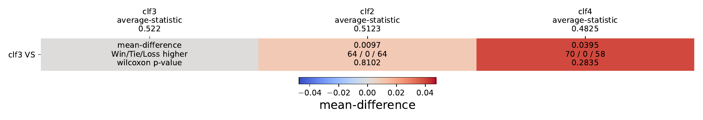

# Multi Pairwise Comparison

### A Long Term Approach to Benchmark Evaluations

This work is done by ```list_of_authors```.

## Summary

This repo is a long term used benchmark method that generates either:

1. A HeatMap for a full 1v1 and multi comparison between classifiers evaluated on multiple dataset.
2. A HeatLine for a 1v1 and multi comparison between a proposed method VS other approaches.

## Input Format

The input format is in a ```.csv``` file containing the statistics of each classifiers as the format of [this example](https://github.com/MSD-IRIMAS/Multi_Pairwise_Comparison/blob/main/results_example.csv).

## Usage of Code

### Variable Adaptations

In the ```main.py``` file, set the:

1. ```path_res``` variable to the path where to find the csv file
2. ```output_dir``` variable to the path where the resulted comparison will be saved

### Extract Comparisons

To extract the comparisons in a json format, the function ```get_analysis``` should be used as in [this line](https://github.com/MSD-IRIMAS/Multi_Pairwise_Comparison/blob/b911733153dbc3d578e649c062385700e9a2146e/main.py#L8). Set the input parameters as ```save_json=True``` to save the ```analysis``` dictionary in json format into ```output_dir```. Information about the input parameters of the ```get_analysis``` function are available [here in the docstring](https://github.com/MSD-IRIMAS/Multi_Pairwise_Comparison/blob/b911733153dbc3d578e649c062385700e9a2146e/ALTAMCBE/ALTAMCBE.py#L25). The resulted analysis are stored in the json file found [here](https://github.com/MSD-IRIMAS/Multi_Pairwise_Comparison/blob/main/analysis.json).

### Plot the HeatMap

To plot the full HeatMap, use the function ```get_heatmap``` as in [this line](https://github.com/MSD-IRIMAS/Multi_Pairwise_Comparison/blob/b911733153dbc3d578e649c062385700e9a2146e/main.py#L13). Information about the input parameters of the ```get_heatmap``` function are available [here in the docstring](https://github.com/MSD-IRIMAS/Multi_Pairwise_Comparison/blob/b911733153dbc3d578e649c062385700e9a2146e/ALTAMCBE/ALTAMCBE.py#L190).

### Plot the HeatLine

To plot the full HeatMap, use the function ```get_line_heatmap``` as in [this line](https://github.com/MSD-IRIMAS/Multi_Pairwise_Comparison/blob/b911733153dbc3d578e649c062385700e9a2146e/main.py#L17), set the ```proposed_method``` string variable to the name of the classifier in question. Information about the input parameters of the ```get_heatmap``` function are available [here in the docstring](https://github.com/MSD-IRIMAS/Multi_Pairwise_Comparison/blob/b911733153dbc3d578e649c062385700e9a2146e/ALTAMCBE/ALTAMCBE.py#L358).

## Examples

Generating the HeatMap on the [following example](https://github.com/MSD-IRIMAS/Multi_Pairwise_Comparison/blob/main/results_example.csv) produces the following.

<p align="center" width="100%">

</p>

Generating the HeatLine on the [following example](https://github.com/MSD-IRIMAS/Multi_Pairwise_Comparison/blob/main/results_example.csv) using a proposed method as clf3 produces the following.

<p align="center" width="100%">

</p>

## Requirements

The following python packages are required for the usage of the module:

1. ```numpy==1.23.5```
2. ```pandas==1.5.2```
3. ```matplotlib==3.6.2```
4. ```scipy==1.10.0```
5. ```baycomp==1.0```
