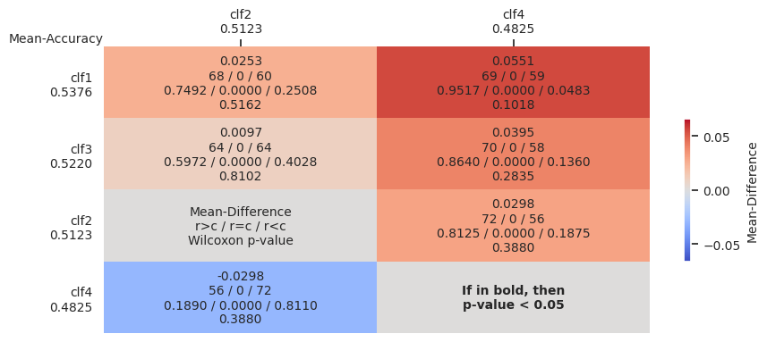
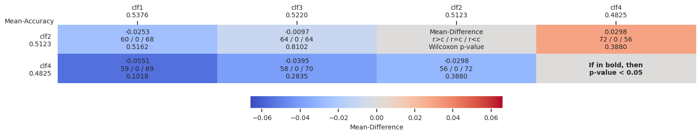

# Multi-Comparison Matrix (MCM)

### This repository contains the software for our paper titled "[An Approach to Multiple Comparison Benchmark Evaluations that is Stable Under Manipulation of the Comparate Set](https://arxiv.org/abs/2305.11921)". This work has been done by [Ali Ismail-Fawaz](https://hadifawaz1999.github.io/), [Angus Dempster](https://dblp.uni-trier.de/pid/251/8985.html), [Chang Wei Tan](https://changweitan.com/), [Matthieu Herrmann](https://orcid.org/0000-0002-0074-470X), [Lynn Miller](https://au.linkedin.com/in/lynn-miller-bb1aa539), [Daniel Schmidt](https://research.monash.edu/en/persons/daniel-schmidt), [Stefano Berretti](http://www.micc.unifi.it/berretti/), [Jonathan Weber](https://www.jonathan-weber.eu/), [Maxime Devanne](https://maxime-devanne.com/), [Germain Forestier](https://germain-forestier.info/) and [Geoff I. Webb](https://i.giwebb.com/).

## Can now be used through [PyPl](https://pypi.org/project/multi-comp-matrix/)

Simply install using `pip install multi-comp-matrix` and use it as explained in the below example section

## Papers Using the MCM:

1. Middlehurst et al. 2024 "[Bake off redux: a review and experimental evaluation of recent time series classification algorithms](https://link.springer.com/article/10.1007/s10618-024-01022-1)" Data Mining and Knowledge Discovery
2. Ismail-Fawaz et al. 2024 "[Finding foundation models for time series classification with a pretext task](https://doi.org/10.1007/978-981-97-2650-9_10)" The Pacific-Asia Conference on Knowledge Discovery and Data Mining - International Workshop on Temporal Analytics
3. Foumani et al. 2023 "[Series2Vec: Similarity-based Self-supervised Representation Learning for Time Series Classification](https://doi.org/10.1007/s10618-024-01043-w)" Data Mining and Knowledge Discovery
4. Holder et al. 2023 "[A review and evaluation of elastic distance functions for time series clustering]([A review and evaluation of elastic distance functions for time series clustering](https://link.springer.com/article/10.1007/s10115-023-01952-0))" Knowledge and Information Systems
5. Ismail-Fawaz et al. 2023 "[LITE: Light Inception with boosTing tEchniques for Time Series Classification](https://ieeexplore.ieee.org/abstract/document/10302569)" IEEE 10th International Conference on Data Science and Advanced Analytics
6. Koh et al. 2023 "[PSICHIC: physicochemical graph neural network for learning protein-ligand interaction fingerprints from sequence data](https://www.biorxiv.org/content/10.1101/2023.09.17.558145v1.abstract)" bioRxiv
7. Ayllón-Gavilán et al. 2023 "[Convolutional and Deep Learning based techniques for Time Series Ordinal Classification](https://arxiv.org/abs/2306.10084)"
8. Ismail-Fawaz et al. 2023 "[ShapeDBA: Generating Effective Time Series Prototypes Using ShapeDTW Barycenter Averaging](https://link.springer.com/chapter/10.1007/978-3-031-49896-1_9)" The European Conference on Machine Learning and Principles and Practice of Knowledge Discovery in Databases Workshop on Advanced Analytics and Learning on Temporal Data
9. Dempster et al. 2023 "[QUANT: A Minimalist Interval Method for Time Series Classification](https://doi.org/10.1007/s10618-024-01036-9)" Data Mining and Knowledge Discovery
10. Holder et al. 2023 "[Clustering Time Series with k-Medoids Based Algorithms](https://link.springer.com/chapter/10.1007/978-3-031-49896-1_4)" The European Conference on Machine Learning and Principles and Practice of Knowledge Discovery in Databases Workshop on Advanced Analytics and Learning on Temporal Data
11. Guijo-Rubio et al. 2023 "[Unsupervised feature based algorithms for time series extrinsic regression](https://doi.org/10.1007/s10618-024-01027-w)" Data Mining and Knowledge Discovery
12. Fischer et al. 2024 "[Towards more sustainable and trustworthy reporting in machine learning](https://doi.org/10.1007/s10618-024-01020-3)." Data Mining and Knowledge Discovery
13. Middlehurst et al. 2024 "[aeon: a Python toolkit for learning from time series](https://www.jmlr.org/papers/v25/23-1444.html)."
14. da Silva et al. 2024 "[Artist Similarity based on Heterogeneous Graph Neural Networks](https://doi.org/10.1109/TASLP.2024.3437170)." IEEE/ACM Transactions on Audio, Speech, and Language Processing
15. Renault, Aurélien, et al. ["Early Classification of Time Series: Taxonomy and Benchmark."](https://arxiv.org/abs/2406.18332) arXiv preprint arXiv:2406.18332 (2024).
16. Spinnato, Francesco, et al. ["Fast, Interpretable and Deterministic Time Series Classification with a Bag-Of-Receptive-Fields."](https://link.springer.com/article/10.1007/s10618-024-01020-3) Data Mining and Knowledge Discovery (2024).
17. Lo, Mouhamadou Mansour, et al. ["Time series classification with random convolution kernels based transforms: pooling operators and input representations matter."](https://arxiv.org/abs/2409.01115) arXiv preprint arXiv:2409.01115 (2024).

## Summary

This repo is a long term used benchmark method that generates a Multi-Comparison Matrix where the user ca choose whether to include a full pairwise multi-comparate comparison or to choose which ones to be included or excluded in the rows and columns of the matrix.

## Input Format

The input format is in a ```.csv``` file containing the statistics of each classifiers as the format of [this example](https://github.com/MSD-IRIMAS/Multi_Pairwise_Comparison/blob/main/results_example.csv).

## Usage of Code - Plot the MCM

In order for the user to plot the MCM, first thing is to load the ```.csv``` file into a ```pandas``` dataframe and feed it to the ```compare``` function. The user should specify the ```pdf_savename```, ```png_savename```, ```csv_savename``` or ```tex_savename``` parameter in order to save the output figure in ```pdf```, ```png```, ```csv``` or ```tex``` formats respecively.

## Examples

Generating the MCM on the [following example](https://github.com/MSD-IRIMAS/Multi_Pairwise_Comparison/blob/main/results_example.csv) produces the following. To generate the following figure, the user follows this simple code:

```
import pandas as pd
from multi_comp_matrix import MCM

df_results = pd.read_csv('path/to/csv')

output_dir = '/output/directory/desired'

MCM.compare(
        output_dir=output_dir,
        df_results=df_results,
        pdf_savename="heatmap",
        png_savename="heatmap",
    )
```

<p align="center" width="100%">

</p>

Generating the MCM on the [following example](https://github.com/MSD-IRIMAS/Multi_Pairwise_Comparison/blob/main/results_example.csv) by excluding ```clf1``` and ```clf3``` from the columns.

```
import pandas as pd
from multi_comp_matrix import MCM

df_results = pd.read_csv('path/to/csv')

output_dir = '/output/directory/desired'

MCM.compare(
        output_dir=output_dir,
        df_results=df_results,
        excluded_col_comparates=['clf1','clf3'],
        png_savename='heatline_vertical',
        tex_savename='heatline_vertical',
        include_ProbaWinTieLoss=True
    )
```

<p align="center" width="100%">

</p>

and by excluding them in the rows.

```
import pandas as pd
from multi_comp_matrix import MCM

df_results = pd.read_csv('path/to/csv')

output_dir = '/output/directory/desired'

MCM.compare(
        output_dir=output_dir,
        df_results=df_results,
        excluded_row_comparates=['clf1','clf3'],
        png_savename='heatline_horizontal',
        csv_savename='heatline_horizontal',
    )
```

<p align="center" width="100%">

</p>

## Colormap

The colormap can be [customized](https://github.com/MSD-IRIMAS/Multi_Comparison_Matrix/blob/ce2c4ebfeda57be5db56e96e71d118996147c91e/multi_comp_matrix/MCM.py#L57) to suit different needs. Users can modify it to enhance readability, including options for colorblind-friendly palettes (e.g., viridis, cividis).

## Requirements

The following python packages are required for the usage of the module:

1. ```numpy==1.24.4```
2. ```pandas==2.0.3```
3. ```matplotlib==3.7.4```
4. ```scipy==1.10.0```
5. ```baycomp==1.0```
6. ```tqdm==4.66.1```


## Citation

If you use this work please make sure you cite this paper:
```
@article{ismail2023approach,
  title={An Approach To Multiple Comparison Benchmark Evaluations That Is Stable Under Manipulation Of The Comparate Set},
  author={Ismail-Fawaz, Ali and Dempster, Angus and Tan, Chang Wei and Herrmann, Matthieu and Miller, Lynn and Schmidt, Daniel F and Berretti, Stefano and Weber, Jonathan and Devanne, Maxime and Forestier, Germain and Webb, Geoff I},
  journal={arXiv preprint arXiv:2305.11921},
  year={2023}
}
```

## Acknowledgments

The work reported in this paper has been supported by the Australian Research Council
under grant DP210100072; the ANR TIMES project (grant ANR-17- CE23-0015); and ANR
DELEGATION project (grant ANR-21-CE23-0014) of the French Agence Nationale de la
Recherche. The authors would like to thank Professor Eamonn Keogh and all the people
who have contributed to the UCR time series classification archive.
